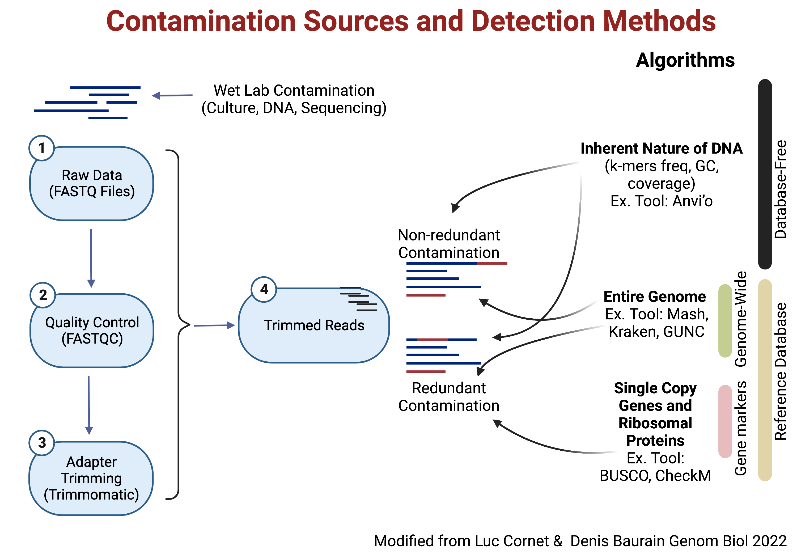

# Microbial Genomics Journey Workshop 2023
## Session 4: Annotation

## Contamination
Figure showing the concepts!


## Intro

**Genome Annotation**
In bioinformatics, genome annotation is a multi-level process that identifies and labels all the relevant features on a genome sequence in order to generate a blueprint for the potential roles and capabilities of an organism.<br/>
This process includes Prediction of :
* protein-coding genes and their putative products (**minimum**)
* other functional genome units
  * structural RNAs
  * tRNAs,
  * small RNAs
  * pseudogenes
  * control regions
  * direct and inverted repeats
  * insertion sequences
  * transposons
  * other mobile elements.

There are various online annotation servers (also available as command-line). Couple of examples:
* The NCBI Prokaryotic Genome Annotation Pipeline ([PGAP](https://www.ncbi.nlm.nih.gov/genome/annotation_prok/)).
* Rapid Annotation using Subsystem Technology ([RAST](https://rast.nmpdr.org/)).

In this course, we will use [Prokka](https://github.com/tseemann/prokka). However, I would highly encourage using [Bakta](https://github.com/oschwengers/bakta) for future work. We chose Prokka as Bakta DB is large to download for the course.

## prokka
Let's annotate the genome that we assembled last time. What is the number of CDS (Hint: check .faa file)?
```
conda activate prokka
cd ~/MGJW/problem_set3/out_S56
prokka contigs.fa
```
Let's annotate a better assembled genome with more options.
```
prokka -h
cd ~/MGJW/problem_set1/fasta
prokka --outdir annot_genome4 --kingdom Bacteria --locustag genom4 --prefix genome4 genome4.fasta
```
## ABRicate
[ABRicate](https://github.com/tseemann/abricate) is a tool for mass screening of contigs for antimicrobial resistance, virulence genes or genes of interest. It comes bundled with multiple databases: NCBI, CARD, ARG-ANNOT, Resfinder, MEGARES, EcOH, PlasmidFinder, Ecoli_VF and VFDB. You can also make your own database.
```
conda activate abricate
cd annot_genome4
abricate -db vfdb genome4.fna
abricate genome4.fna
```

## Further Readings
* [Standard for reporting bacterial genome sequences](https://www.nature.com/articles/nbt.3893) Minimum completeness and maximum contamination.
* [Review: Contamination detection in genomic data](https://genomebiology.biomedcentral.com/articles/10.1186/s13059-022-02619-9)
