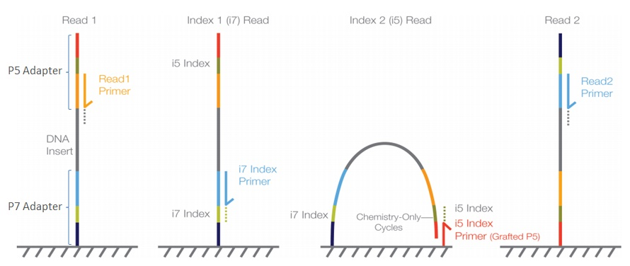

# Microbial Genomics Journey Workshop 2023
## Session 3: Assembly

## Intro

 Illumina Figure showing a paired-end flow cell for MiSeq, HiSeq 2000/2500 and NovaSeq 6000 

**Sample Multiplexing**
Sample multiplexing allows large numbers of libraries to be pooled and sequenced on a single run. This will drastically reduce cost. There are 384 Unique Dual Indexes (Sets A, B, C and D). This means a total of 384 samples can be multiplexed on a single lane.

**Adapter Trimming**
Adapter trimming is the process of removing adapter sequences from the 3’ ends of reads. Adapter sequences should be removed from reads because they interfere with downstream analyses, such as alignment of reads to a reference. it is necessary to eliminate adapter sequences from reads. These adapter sequences contain important elements, including the sequencing primer binding sites, the index sequences, and the sites that facilitate the attachment of library fragments to the flow cell lawn.
