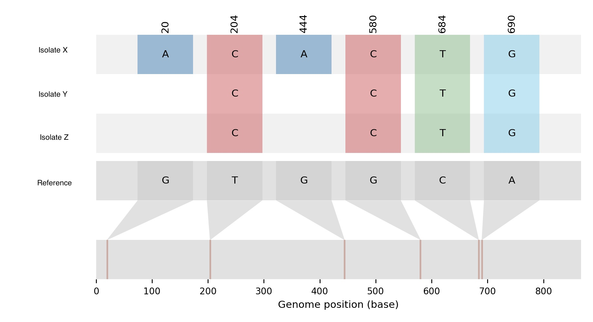

# Visualizing Your SNPs


After running *snippy*, run *snippy-core* to generate the core SNP alignment. 


Optionally, if you are running a set of isolates against one reference, you can use the *snippy-multi* script that is packaged with *snippy*. *Snippy-multi* will also run *snippy-core* at the end of the analysis.

There are many tools that can summarize your SNPs relative to a reference sequence. However, we will focus on using *snipit* and *snp-dists* today.
 
## snipit
### Installing snipit
```
pip install snipit
```

### Running snipit
```
snipit core.aln --solid-background -r Reference 
```

### Looking at the output 



## snp-dists
### Installing snp-dists
```
conda install -c bioconda -c conda-forge snp-dists
```

### Running snp-dists
```
snp-dists core.aln > distances.tab
```

#### Let's take a look at the output!


## Further Information
Check out their GitHub pages:\
snipit - https://github.com/aineniamh/snipit \
snp-dists - https://github.com/tseemann/snp-dists


