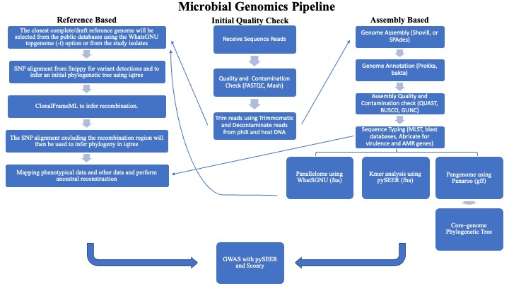

# Microbial Genomics Journey Workshop 2023
## Session 11: Workflows and Pipelines

### Teaching Evaluations
Please evaluate my teaching!<br/>
To start the survey, you may use either of the two choices (the Survey Access Code or
the QR code), whichever you find easiest or quickest to use.
1. Please access this [Survey title: "Teaching Evaluations" link](https://redcap.chop.edu/surveys/). Then enter this code: WAE4YWJYK.
2. Teaching Evaluation QR Code


Please complete the survey below as follows.
* Division of Faculty Member (GI/Nutrition/Hepatology)
* Faculty Member (Ahmed M Moustafa)
* Type of teaching (Lectures/Discussions etc.)
* Date of Teaching (04-26-2023 or any other date during the workshop)
* Topic of Lecture (Microbial Genomics Journey Workshop-12 weeks)
* Your Position (put your position)
* Quality of this instructor (choose a value)
* Comments (optional but will be appreciated)

### updated knowledge map
We started this workshop with "Map your Microbial Genomics knowledge out". Knowledge mapping helps communicate information and solve complex problems. Now it is time to update your knowledge map with what we learnt in this workshop. Here is my version.<br/>


---

### NCBI datasets
[NCBI datasets](https://github.com/ncbi/datasets) is a new resource that lets you easily gather data from across NCBI databases. You can use it to find and download sequence, annotation, and metadata for genes and genomes using command-line interface (CLI) tools or [NCBI Datasets web interface](https://www.ncbi.nlm.nih.gov/datasets/).

#### Installation
`mamba create -n datasets -c conda-forge ncbi-datasets-cli`

#### Usage example
This is a command to download all 71,000 annotated S. aureus genomes from NCBI.<br/>
For recent version:
```
datasets download genome taxon "Staphylococcus aureus" --annotated --include cds --assembly-source GenBank
```
For previous version:
```
datasets download genome taxon "Staphylococcus aureus" --annotated --exclude-gff3 --exclude-protein  --exclude-rna --exclude-seq --assembly-source genbank
```

### Nextflow
[Nextflow](https://www.nextflow.io/) enables scalable and reproducible scientific workflows using software containers. It allows the adaptation of pipelines written in the most common scripting languages.

#### CladeBreaker
[CladeBreaker](https://github.com/andriesfeder/cladebreaker) test the hypothesis of clonality by using the most similar genomes available in the database. If these genomes fail to break up the monophyly of the outbreak clade then this provides the strongest evidence possible for clonality.<br/>

#### Bactopia
[Bactopia](https://bactopia.github.io/v2.2.0/) is a flexible pipeline for complete analysis of bacterial genomes. The goal of Bactopia is process your data with a broad set of tools, so that you can get to the fun part of analyses quicker!

### Snakemake
The Snakemake workflow management system is a tool to create reproducible and scalable data analyses. Workflows are described via a human readable, Python based language. They can be seamlessly scaled to server, cluster, grid and cloud environments, without the need to modify the workflow definition. Finally, Snakemake workflows can entail a description of required software, which will be automatically deployed to any execution environment.

#### Sunbeam
[Sunbeam](https://github.com/sunbeam-labs/sunbeam) is a pipeline written in snakemake by Kyle Bittinger team that simplifies and automates many of the steps in metagenomic sequencing analysis. It can be deployed on most Linux workstations and clusters. To read more, check out their paper in [Microbiome](https://microbiomejournal.biomedcentral.com/articles/10.1186/s40168-019-0658-x).

### ChatGPT
Let's use chatgpt (Model GPT-4) to write a pipeline for assembling a microbial genome from illumina paired-end sequence reads. I did not test this code. I used these prompt messages.
1. Write me a pipeline for assembling a microbial genome from illumina paired-end sequence reads

2. In python quality filter bacterial genomes with trimmomatic, assembly them with spades, annotate them with prokka and generate a pangenome with panaroo

3. Update to iterate over a directory of fastq files and pass each through the workflow and add an argparse option for fastqdir and for number of threads, an integer to pass to the threads option of each software

4. It stopped writing the code in the previous step so I asked it to 'continue the code'.

```
import os
import subprocess
import argparse

def main(fastq_dir, threads):
    # Define input and output directories
    raw_reads_dir = fastq_dir
    trimmed_reads_dir = "trimmed_reads"
    assembly_dir = "assemblies"
    annotation_dir = "annotations"
    pangenome_dir = "pangenome"

    # Create output directories if they don't exist
    os.makedirs(trimmed_reads_dir, exist_ok=True)
    os.makedirs(assembly_dir, exist_ok=True)
    os.makedirs(annotation_dir, exist_ok=True)
    os.makedirs(pangenome_dir, exist_ok=True)

    # Quality filter with Trimmomatic
    for read_file in os.listdir(raw_reads_dir):
        if read_file.endswith("_1.fastq.gz"):
            sample_name = read_file.split("_1.fastq.gz")[0]
            input_forward = os.path.join(raw_reads_dir, f"{sample_name}_1.fastq.gz")
            input_reverse = os.path.join(raw_reads_dir, f"{sample_name}_2.fastq.gz")
            output_forward_paired = os.path.join(trimmed_reads_dir, f"{sample_name}_1_paired.fastq.gz")
            output_forward_unpaired = os.path.join(trimmed_reads_dir, f"{sample_name}_1_unpaired.fastq.gz")
            output_reverse_paired = os.path.join(trimmed_reads_dir, f"{sample_name}_2_paired.fastq.gz")
            output_reverse_unpaired = os.path.join(trimmed_reads_dir, f"{sample_name}_2_unpaired.fastq.gz")

            trimmomatic_cmd = f"trimmomatic PE -threads {threads} -phred33 {input_forward} {input_reverse} {output_forward_paired} {output_forward_unpaired} {output_reverse_paired} {output_reverse_unpaired} ILLUMINACLIP:TruSeq3-PE.fa:2:30:10 LEADING:3 TRAILING:3 SLIDINGWINDOW:4:15 MINLEN:36"
            subprocess.run(trimmomatic_cmd, shell=True, check=True)

    # Assemble with SPAdes
    for trimmed_file in os.listdir(trimmed_reads_dir):
        if trimmed_file.endswith("_1_paired.fastq.gz"):
            sample_name = trimmed_file.split("_1_paired.fastq.gz")[0]
            input_forward = os.path.join(trimmed_reads_dir, f"{sample_name}_1_paired.fastq.gz")
            input_reverse = os.path.join(trimmed_reads_dir, f"{sample_name}_2_paired.fastq.gz")
            output_dir = os.path.join(assembly_dir, sample_name)

            spades_cmd = f"spades.py -t {threads} -1 {input_forward} -2 {input_reverse} -o {output_dir} --careful --only-assembler"
            subprocess.run(spades_cmd, shell=True, check=True)

    # Annotate with Prokka
    for assembly_folder in os.listdir(assembly_dir):
        input_file = os.path.join(assembly_dir, assembly_folder, "contigs.fasta")
        output_dir = os.path.join(annotation_dir, assembly_folder)

        prokka_cmd = f"prokka --cpus {threads} --outdir {output_dir} --prefix {assembly_folder} --force --fast {input_file}"
        subprocess.run(prokka_cmd, shell=True, check=True)

    # Generate pangenome with Panaroo
    gff_files = [os.path.join(annotation_dir, folder, f"{folder}.gff") for folder in os.listdir(annotation_dir)]
    gff_files_str = " ".join(gff_files)

    panaroo_cmd = f"panaroo -i {gff_files_str} -o {pangenome_dir} -t {threads} --clean-mode strict"
    subprocess.run(panaroo_cmd, shell=True, check=True)
if __name__ == "__main__":
  parser = argparse.ArgumentParser(description="Bacterial genome assembly and pangenome analysis pipeline.")
  parser.add_argument("--fastqdir", type=str, required=True, help="Directory containing FASTQ files.")
  parser.add_argument("--threads", type=int, default=1, help="Number of threads to use for each software (default: 1).")
  args = parser.parse_args()
  main(args.fastqdir, args.threads)
```
Chatgpt then reported back that "the script now accepts two command-line arguments: --fastqdir for the directory containing FASTQ files and --threads for the number of threads to use for each software. The default value for --threads is 1 if it is not provided. You can execute this script by saving it to a file (e.g., pipeline.py) and running it from the command line:"
`python pipeline.py --fastqdir /path/to/fastq/files --threads 4`

I will end with this tweet from [Heng Li](https://twitter.com/lh3lh3/status/1646244709055225856)
```
To bioinfo students: if you are unable to solve introductory problems on your own, you may have more troubles with advanced research problems. Before ChatGPT replaces all human programmers, practice is still important.
```

### PFB
* [Programming for Biology Course](https://meetings.cshl.edu/courses.aspx?course=C-INFO&year=22) at Cold Spring Harbor Laboratory.
* Instructed by Simon Prochnik, Circularis Biotech Inc. and Sofia Robb, Stowers Institute for Medical Research.
* Designed for lab biologists with little or no programming experience, this course will give students the bioinformatic sand scripting skills they need to derive biological insights from this abundance of data.
* The only prerequisite for the course is a strong commitment to learning basic UNIX and a scripting language.
* Lectures and problem sets from previous years are available [online](https://github.com/prog4biol).
* They use Python and the course begins with one week of introductory coding, continues with practical topics in bioinformatics, with plenty of coding examples, and ends with a group coding project.

## Further Readings
[DEFINITIONS REGARDING ISOLATE RELATIONSHIPS](https://www.sciencedirect.com/science/article/pii/S1198743X1463192X?via%3Dihub)
[ChatGPT for bioinformatics](https://medium.com/@91mattmoore/chatgpt-for-bioinformatics-404c6d0817a1)
